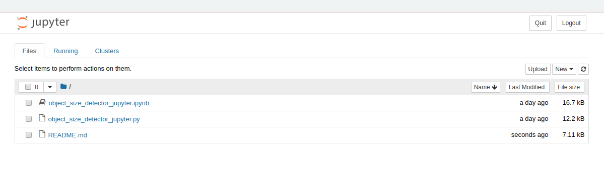
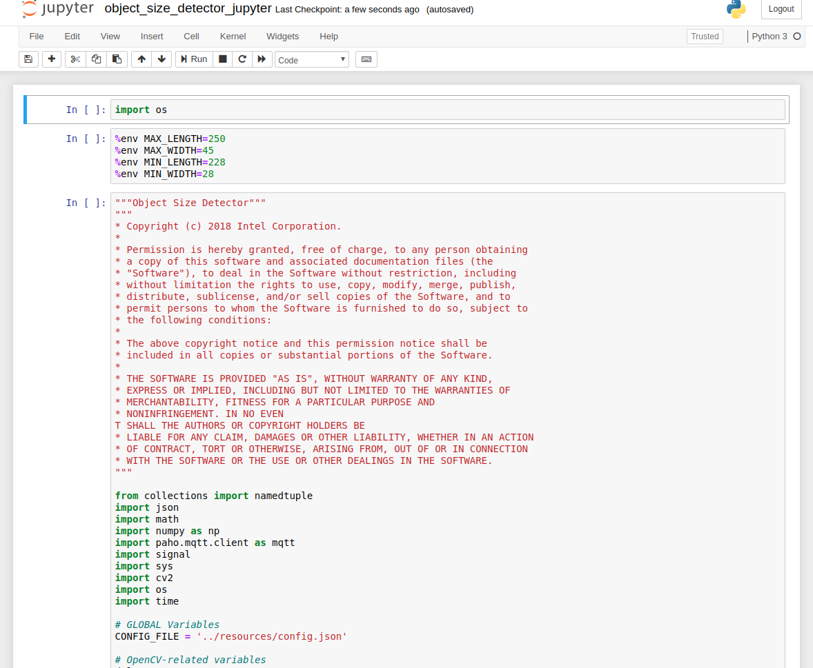

# Object Size Detector

| Details            |              |
|-----------------------|---------------|
| Target OS:            |  Ubuntu\* 18.04 LTS   |
| Programming Language: |  Python* 3.6 |
| Time to Complete:     |  45 min     |


## What it does
This application demonstrates how to use CV to detect and measure the approximate size of assembly line parts. It is designed to work with an assembly line camera mounted above the assembly line belt. The application monitors mechanical parts as they are moving down the assembly line and raises an alert if it detects a part on the belt outside a specified size range.

## Requirements

### Hardware
* 6th to 8th generation Intel® Core™ processor with Iris® Pro graphics or Intel® HD Graphics

### Software
* [Ubuntu\* 18.04 LTS](http://releases.ubuntu.com/18.04/)<br>
   NOTE: Use kernel versions 4.14+ with this software.<br> 
    Determine the kernel version with the below uname command. 
    ```
    uname -a
    ```
* Intel® Distribution of OpenVINO™ toolkit 2020 R3 release toolkit
* Jupyter* Notebook v5.7.0

## How It works

This object size detector works with a video source, such as a camera. The application captures video frames and processes the frame data with OpenCV algorithms. It detects objects on the assembly line and calculates the length and width of the objects. If the calculated length and width is not within a predefined range, the application raises an alert to notify the assembly line operator. Optionally, the application sends data to a message queuing telemetry transport (MQTT) machine, or machine messaging server, as a part of an assembly line data analytics system.


**Architectural Diagram**

## Setup

### Get the code

Steps to clone the reference implementation: (object-size-detector-python)

    sudo apt-get update && sudo apt-get install git
    git clone https://gitlab.devtools.intel.com/reference-implementations/object-size-detector-python.git
    
### Install Intel® Distribution of OpenVINO™ toolkit
Before running the application, install the Intel® Distribution of OpenVINO™ toolkit. For details, see [Installing the Intel® Distribution of OpenVINO™ toolkit for Linux*](https://software.intel.com/en-us/openvino-toolkit/choose-download/free-download-linux)

### Other dependencies
#### Mosquitto*
Mosquitto is an open source message broker that implements the MQTT protocol. The MQTT protocol provides a lightweight method of carrying out messaging using a publish/subscribe model.

To install the dependencies of the RI, run the below command:
   ```
   cd <path_to_the_object-size-detector-python_directory>
   ./setup.sh
   ```
### The Config File

The _resources/config.json_ contains the path to the videos that will be used by the application.
The _config.json_ file is of the form name/value pair, `video: <path/to/video>`   

Example of the _config.json_ file:

```
{

    "inputs": [
	    {
            "video": "videos/video1.mp4"
        }
    ]
}
```

### Which Input video to use

The application works with any input video. Find sample videos for object detection [here](https://github.com/intel-iot-devkit/sample-videos/).  

For first-use, we recommend using the [bolt-multi-size-detection](https://github.com/intel-iot-devkit/sample-videos/blob/master/bolt-multi-size-detection.mp4) video.The video is automatically downloaded to the `resources/` folder.
For example: <br>
The config.json would be:

```
{

    "inputs": [
	    {
            "video": "sample-videos/bolt-multi-size-detection.mp4"
        }
    ]
}
```
To use any other video, specify the path in config.json file

### Using the Camera instead of video

Replace the path/to/video in the _resources/config.json_  file with the camera ID, where the ID is taken from the video device (the number X in /dev/videoX).   

On Ubuntu, list all available video devices with the following command:

```
ls /dev/video*
```

For example, if the output of above command is /dev/video0, then config.json would be::

```
{

    "inputs": [
	    {
            "video": "0"
        }
    ]
}
```

### Setup the Environment

Configure the environment to use the Intel® Distribution of OpenVINO™ toolkit once per session by running the **source** command on the command line:
```
source /opt/intel/openvino/bin/setupvars.sh
```
__Note__: This command needs to be executed only once in the terminal where the application will be executed. If the terminal is closed, the command needs to be executed again.

## Run the Application on Jupyter

* Go to the _object-size-detector-python directory_ and open the Jupyter notebook by running the following commands:

  ```
  cd <path_to_the_object-size-detector-python_directory>/Jupyter
  jupyter notebook
  ```

**Folow the below steps :**



1. Click on **New** button present on the right side of the Jupyter window.

2. Click on **Python 3** option from the drop down list.

3. In the first cell, type **import os** and press **Shift+Enter**.

4. The MIN_LENGTH, MIN_WIDTH, MAX_LENGTH, MAX_WIDTH parameters set the minimum and maximum values for length and width.<br>
   Export these environment variables in second cell and press **Shift+Enter**:<br>
    %env MAX_LENGTH=250<br>
    %env MAX_WIDTH=45<br>
    %env MIN_LENGTH=228<br>
    %env MIN_WIDTH=28<br>

5. Skip this step if field of view of camera and the distance between object and camera are not availabe. These inputs if available are exported as environment variables as given below and press **Shift+Enter**.<br>
   %env DISTANCE = 370<br>
   %env FIELD_OF_VIEW = 60
 

5.  Copy the code of **object_size_detector_jupyter.py** and paste it in the third cell of Jupyter.

6.  Click on **Kernel** present in the menu and then select **Restart & Run All** from the drop down list.

7.  On the pop-up window, click on **Restart and Run All Cells**.

* Alternatively, code can be run in the following way:

    * Click on **object_size_detector_jupyter.ipynb** file in the Jupyter notebook window.
    
    * Click on **Kernel** present in the menu and then select **Restart & Run All** from the drop down list.

    * On the pop-up window, click on **Restart and Run All Cells**.



### Subscribe the data

Open a new terminal and execute the below commands:

**To run the mosquitto server**
```
mosquitto
```
**Note:** If the output of the above command is
```
1543918812: mosquitto version 1.4.8 (build date Wed, 05 Sep 2018 15:51:27 -0300) starting
1543918812: Using default config.
1543918812: Opening ipv4 listen socket on port 1883.
1543918812: Error: Address already in use
```
It means mosquitto server is already running in the background.<br>

**To Subscribe the data**
```
mosquitto_sub -h localhost -t defects/counter
```